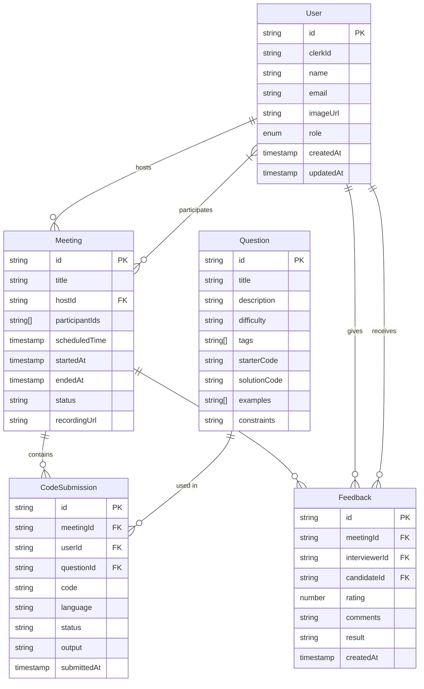
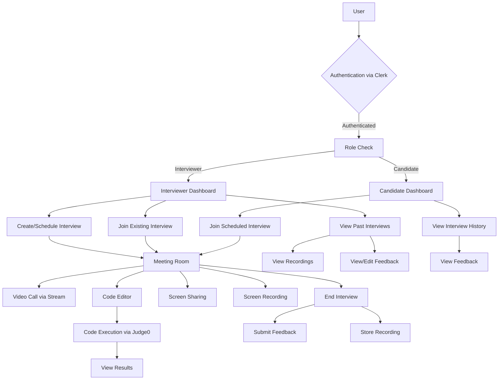
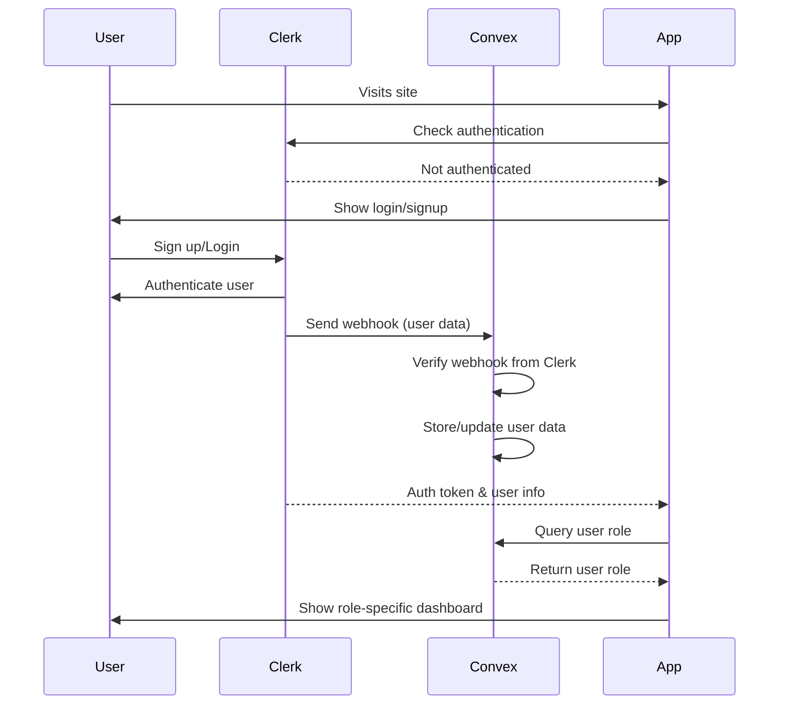
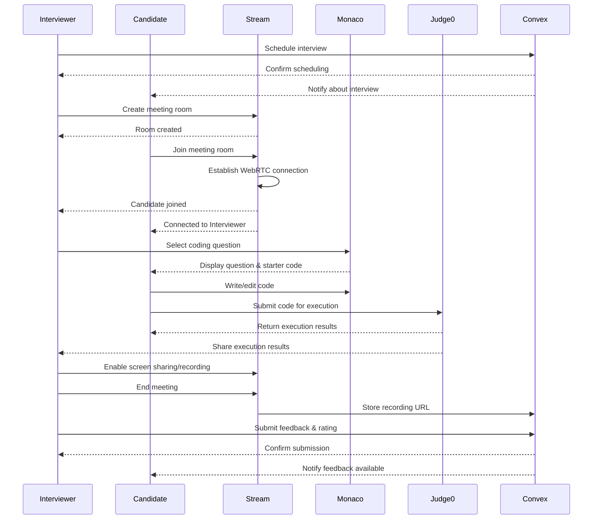
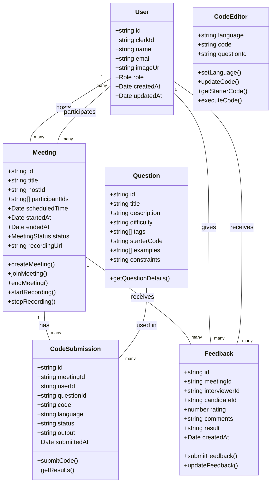

# CodeRoom

CodeRoom is a full-stack, real-time coding interview platform that facilitates technical interviews with features like live video calls, screen sharing, code execution, and structured evaluations. This comprehensive platform streamlines the technical interview process by providing all necessary tools in one integrated environment.

## 🚀 Features

- **Real-time Video Communication**: Video calling and screen sharing through Stream API
- **Screen Recording**: Capture interview sessions for later review
- **Authentication & Authorization**: Secure user management via Clerk
- **Code Editor**: Monaco-based editor with syntax highlighting and multi-language support
- **Real-time Code Execution**: Run code using Judge0 API with instant feedback
- **Interview Management**: Schedule, conduct, and evaluate technical interviews
- **Dashboard**: Review past interviews, add comments, and rate candidate performance
- **Role-based Access**: Different interfaces for candidates and interviewers

## 📋 Tech Stack

- **Frontend**: Next.js 14, TypeScript, Tailwind CSS, shadcn/ui
- **Authentication**: Clerk
- **Backend/Database**: Convex
- **Real-time Communication**: Stream (WebRTC)
- **Code Execution**: Judge0 API
- **Code Editor**: Monaco Editor

## 📐 Architecture Diagrams

### ER Diagram

### System Flow Diagram

### Authentication Flow

### Interview Session Flow

### UML Class Diagram

## 🔄 Complete Workflow

### 1. User Registration & Authentication

1. A new user visits the platform and signs up using Clerk authentication
2. Clerk handles the authentication process and sends a webhook to Convex
3. Convex verifies the webhook origin and stores the new user's information
4. The user is assigned a role (candidate or interviewer)
5. Based on the role, the user is directed to the appropriate dashboard

### 2. Interview Scheduling (Interviewer Flow)

1. An interviewer logs into their dashboard
2. They access the scheduling page to create a new interview
3. They select a candidate, date, time, and optionally other interviewers
4. The system creates a meeting record in Convex
5. The candidate receives a notification about the scheduled interview

### 3. Meeting Creation & Joining

1. At the scheduled time, the interviewer initiates the meeting room via Stream API
2. The system generates a unique meeting link
3. The candidate joins using the provided link
4. Stream handles the WebRTC connection for video/audio communication
5. The host (interviewer) has additional controls like ending the meeting for all

### 4. Code Interview Process

1. The interviewer selects a coding question from the available library
2. The Monaco editor loads with the appropriate starter code for the selected question
3. The candidate can see the question description, examples, and constraints
4. The candidate writes/edits code in the editor
5. The code can be executed using the Judge0 API
6. Execution results are displayed in real-time to both parties
7. The interviewer can observe the candidate's coding process and problem-solving approach
8. Screen sharing is available for additional explanations or demonstrations

### 5. Interview Recording & Evaluation

1. The interviewer can record the session using Stream's recording feature
2. When the interview ends, the recording URL is stored in Convex
3. The interviewer submits feedback, including:
   - Rating (1-10 scale)
   - Comments about the candidate's performance
   - Pass/Fail decision
4. This feedback is stored in Convex linked to the specific interview session

### 6. Post-Interview Review

1. Interviewers can access past interviews from their dashboard
2. They can view recordings, review code submissions, and edit feedback
3. Candidates can view their interview history and feedback
4. The platform maintains a comprehensive history of all interviews and evaluations

This workflow creates a complete cycle from scheduling to evaluation, providing a seamless experience for both interviewers and candidates while maintaining detailed records of all interactions.
