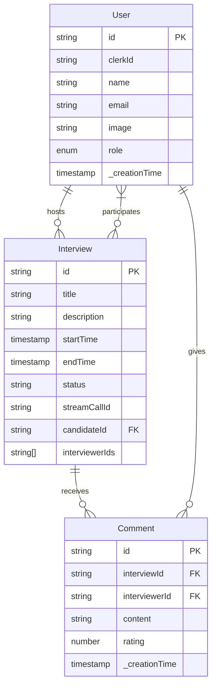
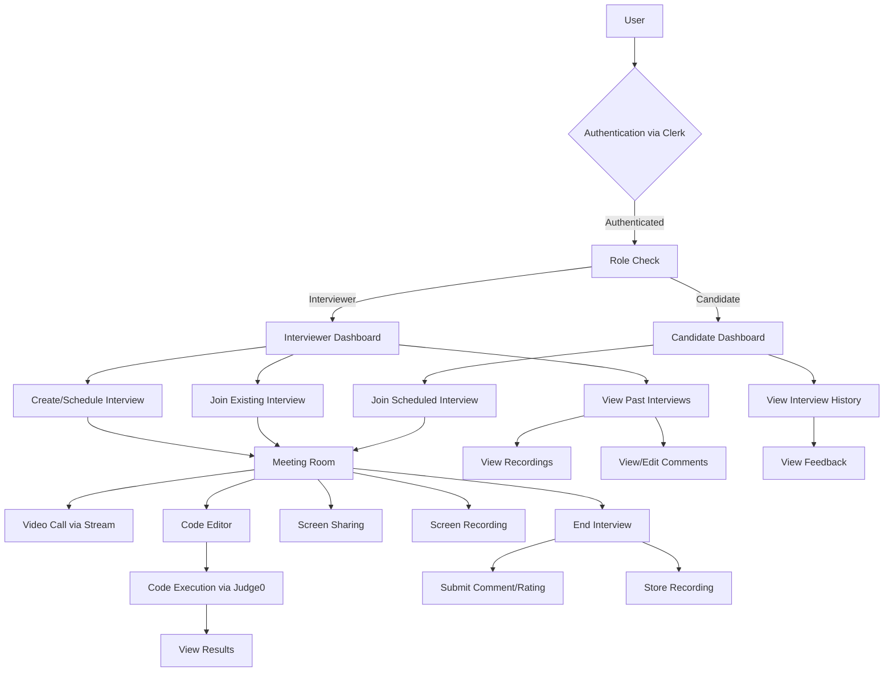
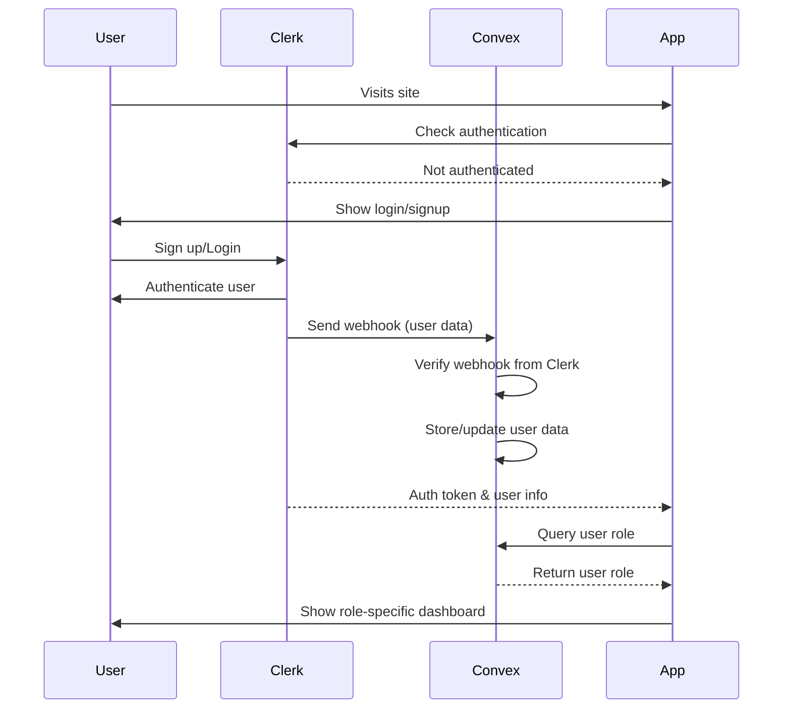
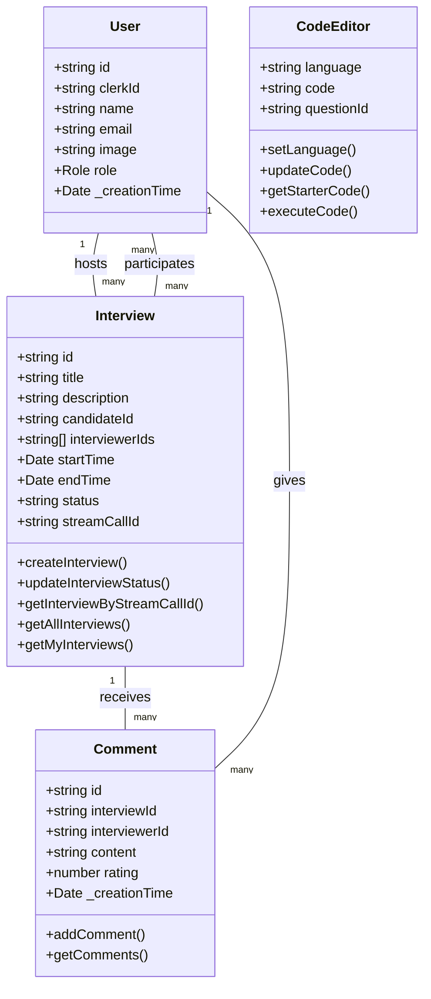

# CodeRoom

CodeRoom is a full-stack, real-time coding interview platform that facilitates technical interviews with features like live video calls, screen sharing, code execution, and structured evaluations.

## 🚀 Features

### Real-time Video Communication
Powered by Stream API, CodeRoom offers high-quality video and audio communication between interviewers and candidates. The platform supports multi-participant video calls, ensuring smooth communication regardless of geographical location.

### Screen Sharing & Recording
Interviewers can share their screens to explain concepts or demonstrate code solutions. The platform also allows for recording entire interview sessions, which can be reviewed later by the hiring team for comprehensive candidate evaluation.

### Secure Authentication
Built with Clerk authentication, CodeRoom provides enterprise-grade security for user management. The system supports email/password authentication with proper role-based access control between interviewers and candidates.

### Advanced Code Editor
CodeRoom integrates Monaco Editor (the engine behind VS Code) to provide a professional coding experience with:
- Syntax highlighting for multiple programming languages
- Code auto-completion
- Line numbering and error indicators
- Customizable themes and settings

### Real-time Code Execution
Powered by Judge0 API, candidates can execute their code in real-time across multiple languages:
- JavaScript (Node.js)
- Python
- Java
- C++
- C

The execution results, including output, errors, and compilation issues, are displayed instantly to both the interviewer and candidate.

### Comprehensive Interview Management
Interviewers can:
- Schedule interviews with specific date and time slots
- Invite multiple participants to an interview
- Select from a library of coding questions
- Rate candidate performance with a 1-5 star system
- Provide detailed comments and feedback
- Mark interviews as passed or failed

### Dashboard & Analytics
The platform provides an intuitive dashboard for managing all interview-related activities:
- Upcoming interviews
- Completed interviews
- Passed and failed candidate sessions
- Access to interview recordings
- Historical performance data

## 📋 Tech Stack

- **Frontend**: Next.js 14, TypeScript, Tailwind CSS, shadcn/ui
- **Authentication**: Clerk
- **Backend/Database**: Convex
- **Real-time Communication**: Stream (WebRTC)
- **Code Execution**: Judge0 API
- **Code Editor**: Monaco Editor

## 📐 Architecture Diagrams

### ER Diagram



### System Flow Diagram



### Authentication Flow



### Interview Session Flow


### UML Class Diagram



## 🔄 System Flow Explained

### User Journey and Role-Based Access
The system flow diagram illustrates how users navigate through the CodeRoom platform based on their roles. After authentication, users are directed to role-specific dashboards:

1. **Interviewer Dashboard**: Provides functionalities for creating, scheduling, and managing interviews. Interviewers can view all past interviews, including recordings and performance metrics.

2. **Candidate Dashboard**: Focuses on upcoming interviews, joining active sessions, and reviewing interview history and feedback.

Both roles converge in the Meeting Room, which serves as the central hub for the actual interview process, containing video communication, code editing, and execution components.

### Core Functionalities
The diagram highlights four primary features accessible within the Meeting Room:
- **Video Calls**: Real-time audio/video communication
- **Code Editor**: Collaborative coding environment
- **Screen Sharing**: Visual demonstrations and explanations
- **Screen Recording**: Session capture for later review

The code execution flow shows how code written by candidates is processed through Judge0 API, with results being immediately displayed to both participants.

### Post-Interview Process
After an interview ends, three key actions occur:
1. The meeting recording is stored for future reference
2. Interviewers submit ratings and comments
3. Candidates can access feedback through their dashboard

## 🔐 Authentication Flow Explained

CodeRoom implements a secure authentication system using Clerk, which handles all user identity management. The authentication process follows these steps:

1. **Initial Access**: When a user visits CodeRoom, the application checks with Clerk to determine authentication status.

2. **Authentication**: Unauthenticated users are redirected to Clerk's login/signup interface. Clerk handles all identity verification, password management, and security measures.

3. **Webhook Processing**: Upon successful authentication, Clerk sends a webhook to Convex containing the user's information. This is processed in the `http.ts` file, which:
   - Verifies the webhook's authenticity using the CLERK_WEBHOOK_SECRET
   - Extracts user data including ID, email, name, and profile image
   - Synchronizes this data with the Convex database

4. **User Creation/Update**: For new users, a record is created in the users table with a default role of "candidate". For returning users, their information is updated if needed.

5. **Role-Based Routing**: After authentication, the application queries the user's role from Convex and directs them to the appropriate dashboard based on whether they're an interviewer or candidate.

This system ensures secure identity management while maintaining proper role separation within the application.

## 🎯 Interview Session Flow Explained

The interview session represents the core user experience of CodeRoom, bringing together real-time communication, code evaluation, and feedback in a seamless process:

### Pre-Interview Phase
1. **Scheduling**: An interviewer creates a new interview session by:
   - Selecting a candidate from registered users
   - Setting a date and time
   - Adding other interviewers (optional)
   - Providing a title and description

2. **Notification**: The system records the interview details in Convex and makes it visible on the candidate's dashboard.

### Interview Execution
1. **Session Initialization**: When the interview time arrives, the interviewer starts the meeting, creating a Stream call room with a unique ID that's stored in the interview record.

2. **Joining Process**: Both parties join the virtual interview room, where Stream's WebRTC technology establishes secure peer-to-peer video communication.

3. **Setup Phase**: Before beginning, participants can:
   - Configure their audio/video devices
   - Test their microphone and camera
   - Enable/disable video as needed

4. **Coding Assessment**: The interview proceeds to the technical evaluation where:
   - The interviewer selects from predefined coding questions
   - Monaco Editor loads with language-specific starter code
   - The candidate writes their solution while the interviewer observes
   - Code can be executed against test cases using Judge0 API
   - Results are displayed in real-time to both parties

5. **Collaboration Tools**: Throughout the session, participants can:
   - Share screens to explain concepts or demonstrate solutions
   - Record the session for later review
   - Switch between grid and speaker view for optimal interaction

### Post-Interview Phase
1. **Session Termination**: The interviewer ends the call, which:
   - Updates the interview status in the database
   - Finalizes any recordings
   - Returns both users to their respective dashboards

2. **Evaluation**: The interviewer provides feedback by:
   - Rating the candidate on a 5-star scale
   - Adding detailed comments about performance
   - Marking the interview as passed or failed

3. **Review Access**: The candidate can view feedback and comments from their dashboard, while the interview recording remains available for the hiring team to review.

## 🔄 Complete Workflow

### 1. User Registration & Authentication

1. **Initial Registration**: New users sign up via Clerk's authentication interface.
   
2. **Account Creation**: Clerk verifies the user's identity and triggers a webhook to Convex.
   
3. **Data Synchronization**: The webhook handler in `convex/http.ts` processes the user data:
   ```typescript
   if (eventType === "user.created") {
     await ctx.runMutation(api.users.syncUser, {
       clerkId: id,
       email,
       name,
       image: image_url,
     });
   }
   ```
   
4. **Role Assignment**: By default, new users are assigned the "candidate" role. Admin intervention can change this to "interviewer" as needed.
   
5. **Dashboard Routing**: The user is directed to their role-specific dashboard through the `useUserRole` hook:
   ```typescript
   const { isInterviewer, isCandidate } = useUserRole();
   ```

### 2. Interview Scheduling (Interviewer Flow)

1. **Schedule Access**: Interviewers navigate to the scheduling interface through the dashboard.
   
2. **Interview Creation**: The interviewer:
   - Provides a title and optional description
   - Selects a candidate from registered users
   - Adds additional interviewers if needed
   - Sets date and time using the calendar interface
   
3. **Stream Integration**: A unique Stream call ID is generated and associated with the interview.
   
4. **Database Storage**: The interview details are stored in Convex using the `createInterview` mutation:
   ```typescript
   await createInterview({
     title,
     description,
     startTime: meetingDate.getTime(),
     status: "upcoming",
     streamCallId: id,
     candidateId,
     interviewerIds,
   });
   ```
   
5. **Notification**: The scheduled interview appears on the candidate's dashboard in the "Upcoming Interviews" section.

### 3. Meeting Creation & Joining

1. **Meeting Initialization**: At the scheduled time, participants can join through:
   - Direct link from the interview card
   - Meeting ID for manual joining
   
2. **Device Setup**: The `MeetingSetup` component allows users to:
   - Test and select audio/video devices
   - Enable/disable camera and microphone
   - View meeting details before joining
   
3. **Room Entry**: Upon joining, Stream's WebRTC technology establishes peer-to-peer connections between all participants.
   
4. **Layout Options**: Users can switch between:
   - Grid view for equal visibility of all participants
   - Speaker view that highlights the active speaker

### 4. Code Interview Process

1. **Question Selection**: Interviewers choose from a library of coding questions defined in the `CODING_QUESTIONS` constant, each with:
   - Title and description
   - Example inputs and outputs
   - Constraints
   - Starter code in multiple languages
   
2. **Language Selection**: Candidates can select their preferred programming language from:
   - JavaScript
   - Python
   - Java
   - C++
   - C
   
3. **Coding Environment**: The Monaco editor provides a professional IDE experience with:
   - Syntax highlighting
   - Line numbers
   - Error indicators
   
4. **Code Execution**: When the candidate submits their code:
   - The code is sent to Judge0 API via `/api/execute`
   - The API processes the code in the selected language
   - Results, including output or errors, are returned and displayed
   - Both interviewer and candidate can view the execution results

### 5. Interview Recording & Evaluation

1. **Session Recording**: Stream's API handles the recording process, capturing:
   - Audio and video communication
   - Screen sharing content
   - The entire session duration
   
2. **Meeting Conclusion**: The interviewer ends the meeting, which:
   - Updates the interview status to "completed"
   - Finalizes and stores any recordings
   - Returns participants to their dashboards
   
3. **Feedback Submission**: Interviewers provide evaluation through the `CommentDialog` component:
   - Rating on a 5-star scale
   - Detailed comments on performance
   - The feedback is stored in the `comments` table
   
4. **Interview Status**: Interviewers mark the interview as:
   - Succeeded (passed)
   - Failed
   - This status is updated in the database via `updateInterviewStatus`

### 6. Post-Interview Review

1. **Recording Access**: All recordings are accessible through the Recordings page, where users can:
   - Play recordings directly in the browser
   - Copy recording links for sharing
   - See recording duration and timestamps
   
2. **Interview History**: The dashboard displays:
   - Upcoming interviews
   - Completed interviews
   - Succeeded interviews
   - Failed interviews
   
3. **Feedback Review**: Candidates can view comments and ratings left by interviewers
   
4. **Analytics**: Interviewers can track performance across multiple interviews, helping to standardize evaluation metrics.

This end-to-end workflow creates a comprehensive platform for technical interviews, combining real-time communication, code assessment, and structured evaluation in a single integrated experience.
